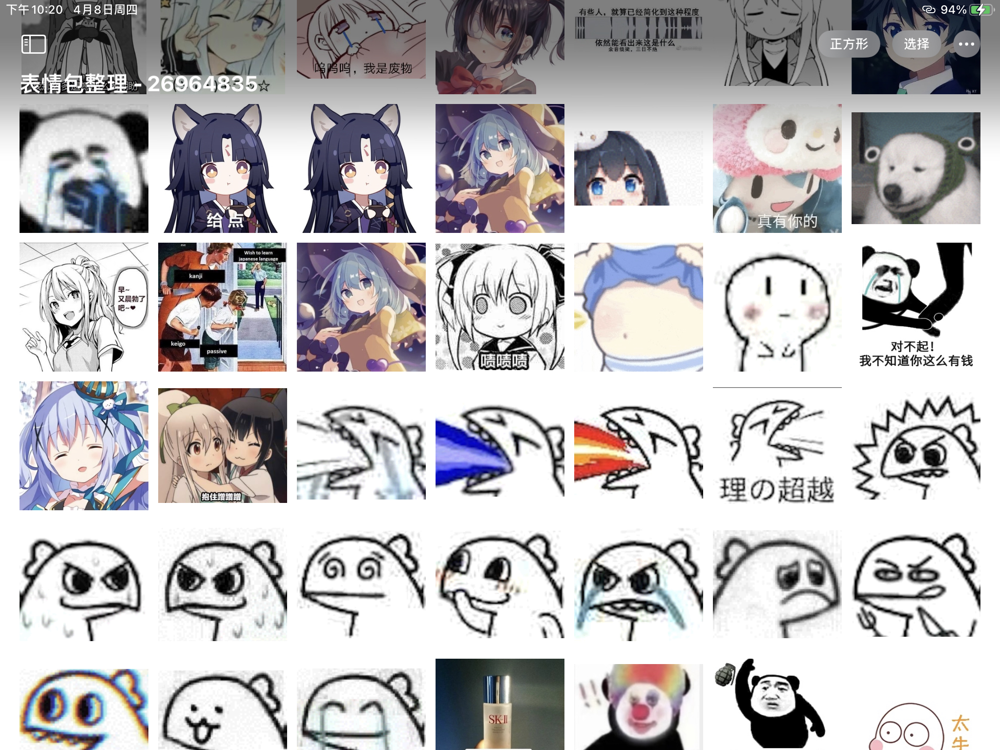

# BQBClassifier 🕶️

Given that my photo albums are mixed with various emojis that often spoil my good mood, I wrote such an app to organize my albums. With a core made with artificial intelligence, it uses nearly 50G of emojis and daily photos as training data and deeply integrates CoreML technology to provide a very perfect user experience ~~for myself~~.

## License

This project uses the MIT license, so you can play around with it.

## Notice

Machine learning is not perfect. This model provides a near-perfect recognition success rate of close to 95% in my daily use. However the variability in the characteristics of the data generated by different users can be significant. In the worst case, the recognition success rate may still be only 10%. Please be aware of this.

> 大佬说自己水那都是 SK II

Although we disclose the results of machine learning, models, we do not provide training data because they are very relevant to individuals and involve a lot of privacy. If you want to train your own models, please be bold. Replace the model within the project and it will be automatically applied to the app.

## Contributors

Without their hard work, this project would not have been possible today.

- [Lakr233](https://twitter.com/Lakr233)
- [Innei](https://twitter.com/__oQuery)

---

Copyright (c) 2021 Lakr Aream & Innei

2021.4.8